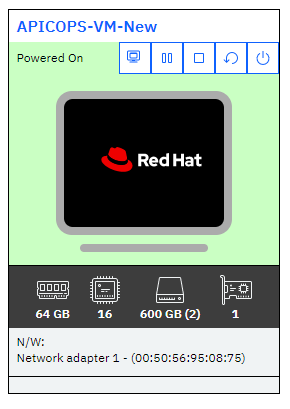

# Introduction

Welcome to the IBM API Connect v10 Operations course. In this course you will learn
how to deploy, manage and operate IBM API Connect v10. During this course you will
be guided through theoretical knowledge about the product and perform guided exercises
in virtual classroom provided to you by your instructor.

## Orientation in classrom - IRLP Skytap

Your instructor will provide you with individual links to your environment.

You are provided with 1 Virtual Machine SOLEIL environment:

* APICOPS-VM-New (10.0.0.10)



You will be working as user ```root``` with password ```passw0rd```.

All the endpoints configured in guided exercises are within domain ```think.ibm```.

Check all configued endpoints by viewing `/etc/hosts` file after logging in and opening Terminal:
```bash 
$ cat /etc/hosts
```

When you open your virtual machine by clicking on its icon or name, your input is being transferred to the virtual machine. This do not
include your desktop's clipboard. In the top of your virtual machine screen you will get the panel to interact with the environment:


Below is the explanation of most commonly used options:

* Send ```CTRL + ALT + DEL``` key combination to VM.
  
  

* Fit to Window
  
  

* Fullscreen
  
  

* Keyboard language
  
  

* Send Text:
  
  

  * Copying to Virtual Machine's clipboard from your desktop's clipboard 
    1. Copy text to your desktop's clipboard.
    2. Paste your clipboard contents into the text field using ```CTRL + V```/```Command + V``` keyboard shortcut or context menu.
    3. Press **Send text** button, it will auto-type the pasted content.

* Reload

  

* Latency information

  
