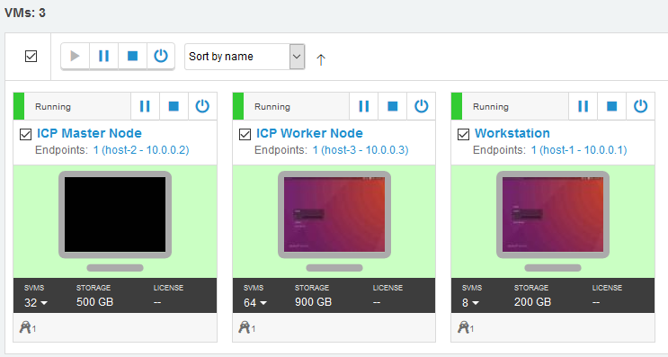

# Introduction

Welcome to the IBM API Connect v10 Operations course. In this course you will learn
how to deploy, manage and operate IBM API Connect v10. During this course you will
be guided through theoretical knowledge about the product and perform guided exercises
in virtual classroom provided to you by your instructor.

## Orientation in classrom - IRLP Skytap

Your instructor will provide you with individual links to your environment.

You are provided with 1 Virtual Machine SOLEIL environment:

* Workstation (10.0.0.10)



You will be working as user ```root``` with password ```passw0rd```.

All the endpoints configured in guided exercises are within domain ```think.ibm```.

When you open your virtual machine by clicking on its icon or name, your input is being transferred to the virtual machine. This do not
include your desktop's clipboard. In the top of your virtual machine screen you will get the panel to interact with the environment:


Below is the explanation of most commonly used options:

* Access to environment VMs. After clicking button highlighted below you will be able to switch to other VMs or review all VMs.
  
  

* Power operations for actual VM: Suspend, Shutdown and additional Power Options respectively.
  
  

* Credentials store
  
  

* Clipboard control:
  
  

  * Copying from Virtual Machine's clipboard to your desktop's clipboard:
    
    1. Copy text to Virtual Machine's clipboard.
    2. Use "Clipboard" button to preview Virtual Machine's clipboard. It will have all the contents already selected.
    3. Copy the content into your desktop's clipboard by either using ```CTRL + C```/```Command + C``` keyboard shortcut or context menu.
    4. Paste the content on your desktop.

  * Copying to Virtual Machine's clipboard from your desktop's clipboard 
    1. Copy text to your desktop's clipboard.
    2. Use "Clipboard" button to preview Virtual Machine's clipboard. Paste your clipboard contents into the text field using ```CTRL + V```/```Command + V``` keyboard shortcut or context menu. This will populate your Virutal Machine's clipboard with pasted content.
    3. Paste the content inside your Virtual Machine.

* Display control: Fit to Window and Change Resolution

  

* Show or hide Skytap Operations Panel

  

> **Note** If for any reason the environment will be suspended, you can resume the Workstation VM, however both ICP Master and ICP Worker will have to be
> Powered Off (not Shutdown!) and Powered On again.
