# Guided Exercise: Configuring the Cloud

This tutorial shows you how to create a basic cloud configuration, with
available gateway, analytics and developer portal services.

## Before You Begin

Make sure that you have completed [Guided Exercise: Installing API Connect v10](../chapter01/01.lab-installation.md).

You will need the following information to complete this tutorial.
* Endpoint (FQDN) of the gateway assigned to accept API requests from clients.
* Endpoint (FQDN) of the gateway assigned to communicate with the API Management server. This cannot be the same as the endpoint for API requests.
* Endpoint (FQDN) of the Developer Portal service assigned to accept requests from clients.
* Endpoint (FQDN) of the Developer Portal assigned to communicate with the API Management server. This cannot be the same as the port for client requests.
* Endpoint (FQDN) of the Analytics service to accept requests from clients.
* The address, port and login credentials for an SMTP email server.

The information may be gathered from the following commands:
```
[root@think ~]# kubectl get ingress -A
NAMESPACE    NAME                      CLASS    HOSTS                  ADDRESS     PORTS     AGE
apiconnect   analytics-ac-endpoint     <none>   ac.think.ibm           10.0.0.10   80, 443   9m33s
apiconnect   analytics-ai-endpoint     <none>   ai.think.ibm           10.0.0.10   80, 443   9m31s
apiconnect   gwv6-gateway              <none>   rgw.think.ibm          10.0.0.10   80, 443   21m
apiconnect   gwv6-gateway-manager      <none>   rgwd.think.ibm         10.0.0.10   80, 443   21m
apiconnect   management-admin          <none>   admin.think.ibm        10.0.0.10   80, 443   29m
apiconnect   management-api-manager    <none>   manager.think.ibm      10.0.0.10   80, 443   29m
apiconnect   management-consumer-api   <none>   consumer.think.ibm     10.0.0.10   80, 443   29m
apiconnect   management-platform-api   <none>   api.think.ibm          10.0.0.10   80, 443   29m
apiconnect   portal-portal-director    <none>   api.portal.think.ibm   10.0.0.10   80, 443   13m
apiconnect   portal-portal-web         <none>   portal.think.ibm       10.0.0.10   80, 443   13m
default      mailhog                   <none>   mailhog.think.ibm      10.0.0.10   80        47h
[root@think ~]# kubectl get service
NAME         TYPE        CLUSTER-IP       EXTERNAL-IP   PORT(S)             AGE
kubernetes   ClusterIP   10.96.0.1        <none>        443/TCP             299d
mailhog      ClusterIP   10.101.125.118   <none>        1025/TCP,8025/TCP   47h
```


### About this tutorial


In this tutorial you are going to complete the following:

* Initial Cloud Manager Console login
* Configure an Email Server
* Register a Gateway Service
* Register a Portal Service
* Register an Analytics Service
* Configure a Default Gateway Service

## Initial Cloud Manager Console login

Take the following steps to log in to the Cloud Manager user
interface for the first time.

1.  In a web browser, enter the management service URL:
    https://admin.think.ibm

    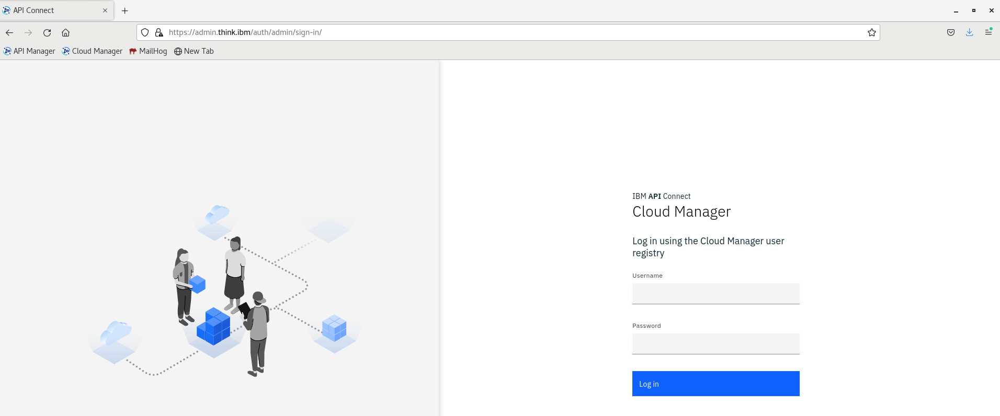

2.  Enter the Cloud Administrator user name and password. The default
    values are admin for the user name and `7iron-hide` for the password.
3.  You are immediately required to change the admin password, as well
    as provide an email address for the cloud administrator. Enter the
    necessary information.

    > **Note**
    > If you forget your password and request a
    > password reset, the notification email is sent to this email
    > address. This action will use the email server set in the
    > **Notifications** section of the cloud **Settings**.
    
    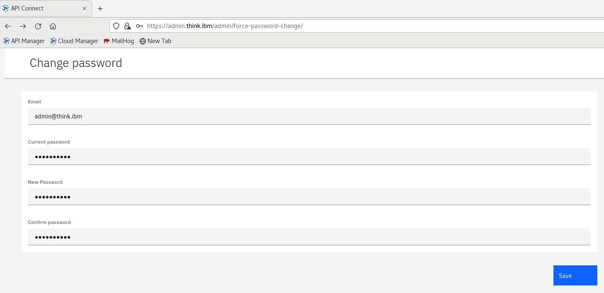

4.  Click **Save**.

Once password is changed, you should see API Connect Cloud Manager window:

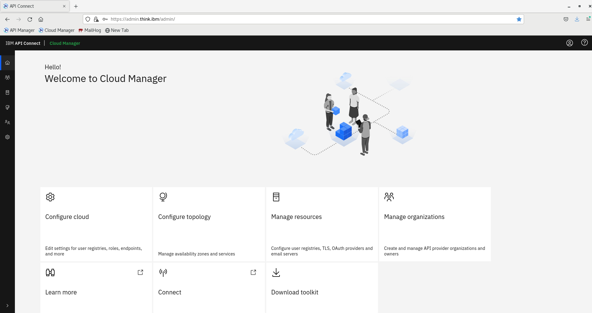


### Configure an Email Server


Take the following steps to configure an email server. This
configuration allows you to recover the admin password or receive other
important notifications.

1.  Click **Settings** icon in the left panel or **Configure Cloud** tile in home page. Go to **Notifications** page and click **Edit** button in **Sender and Email Server** section.

    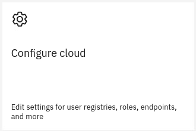

2.  Provide email address ```admin@think.ibm```. Click **Save**.

3.  Click **Edit** again and **Configure Email Server**. Type in following information:
    
    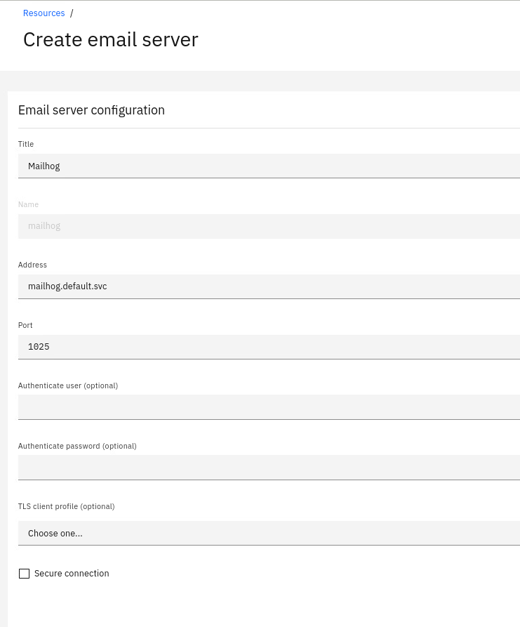

4.  Click **Test email** and provide any email address, i.e. ```user@think.ibm```.

    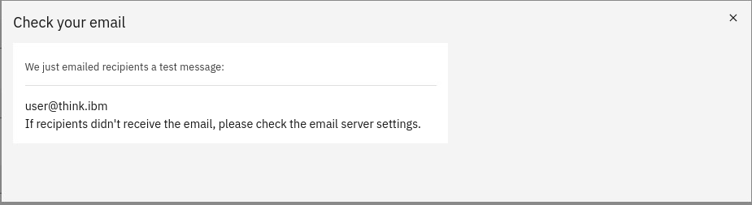

5.  Check if email has been received. Open **MailHog** from Bookmark Toolbar or open page https://mailhog.think.ibm.

    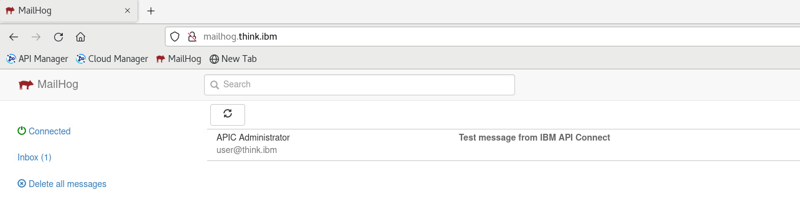

## Register a Gateway Service


Take the following steps to register a gateway service.

1.  Go back to home page and click the **Configure Topology** tile.

    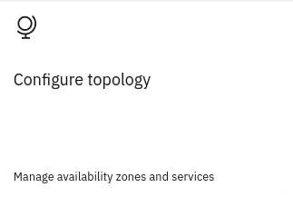

2.  Click **Register Service**. Click **DataPower API Gateway**.

3.  Take the following steps:

    1.  Enter "API Gateway" in the **Title** field.
    2.  In the **Management Endpoint** section, enter the
        URL of the address and port assigned to the management endpoint
        in the **Endpoint** field. This is the port used
        by the API Management server to connect to the gateway: https://rgwd.think.ibm
    3.  Leave the remaining values as given to set TLS profiles.

    4.  In the **API Invocation Endpoint** section, enter
        the URL of the gateway address and port assigned to accept API
        requests from clients in the **API Endpoint Base**
        field: https://rgw.think.ibm

    5.  Do not change the defaults in the **Server Name Indication (SNI)** fields. Note that your topology may
        require specific values in these fields.
    6.  Click **Save**.

        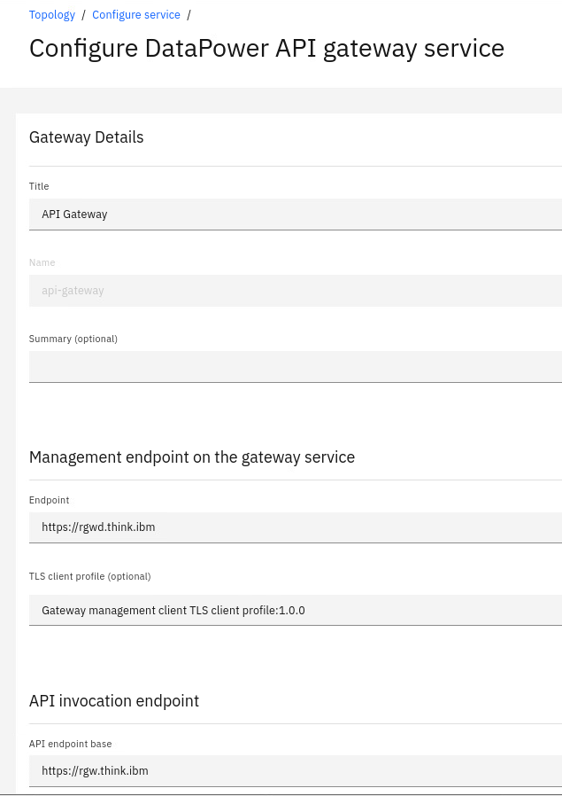
    

## Register a Portal Service

Take the following steps to register a portal service.

1.  Click **Register Service**.
2.  Click **Portal**.
3.  Take the following steps:

    1.  Enter "Portal" in the **Title** field.
    2.  In the Management Endpoint section, enter the URL of the portal
        address and port assigned to communicate with the management
        server in the **Endpoint** field.
    3.  Enter the URL of the portal address and port assigned to accept
        requests from clients in the **Portal Website URL** field.
    4.  Use the reconfigured profile in the **TLS Client Profile** field.
    5.  Click **Save**.

        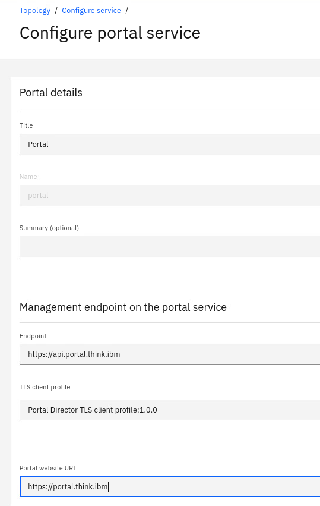
    

## Register an Analytics Service


Take the following steps to register an analytics service.

1.  Click **Register Service**
2.  Click **Analytics**.
3.  Take the following steps.
    1.  Enter analytics\_service in the **Title** field.
    2.  In the Management Endpoint section, enter the URL of the
        analytics server address and port assigned to accept requests
        from clients in the **Endpoint** field.
    3.  Select Analytics client TLS client profile in the **TLS Client Profile** field.
    4.  Click **Save**.

        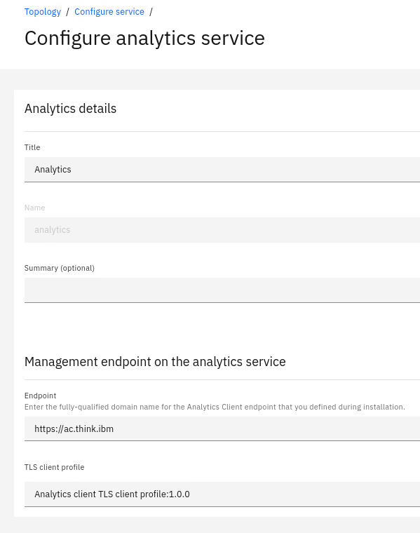
    
4.  Click **Associate Analytics Service** next to "API Gateway" DataPower API Gateway Service.
        
5.  Select **Analytics**. Click **Associate**.

Your topology should be defined as follows:

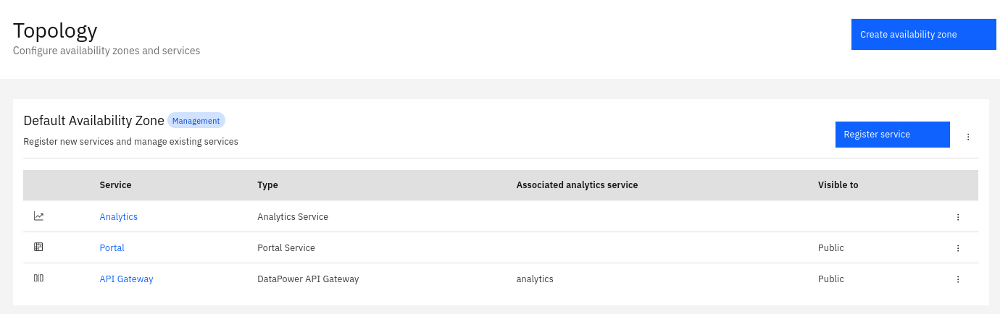

## Configure a Default Gateway Service

Take the following steps to configure a default gateway service for your API Connect Cloud.

1.  Click **Settings** icon or go to home page and click **Cloud settings** tile.
2.  Click **Catalog Defaults**. Click **Edit**.
3.  Select an available gateway service.
4.  Click **Save**.

    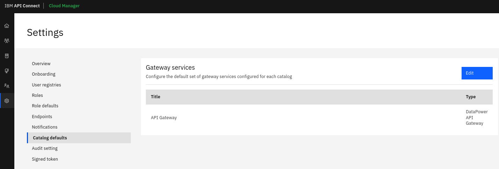
    
## Summary

In this exercise you have configured new API Connect v10 instance. Now you can create a provider organization and your first API.
