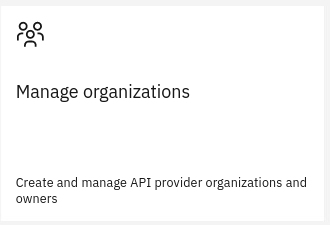
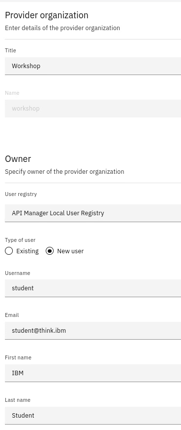
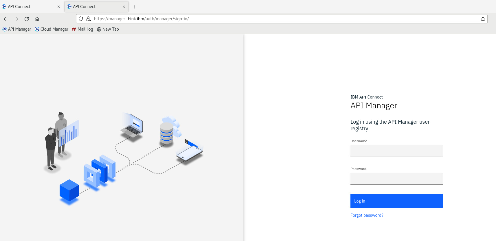
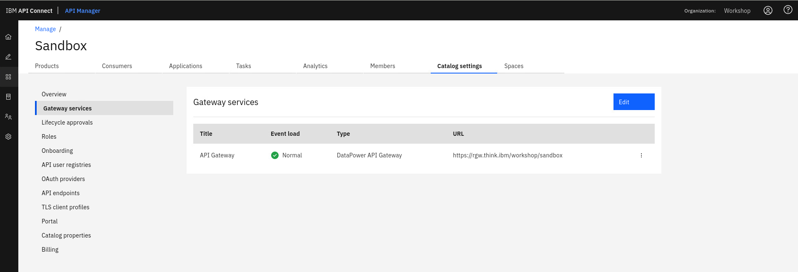
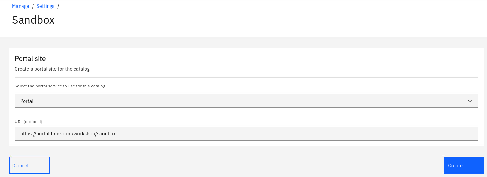
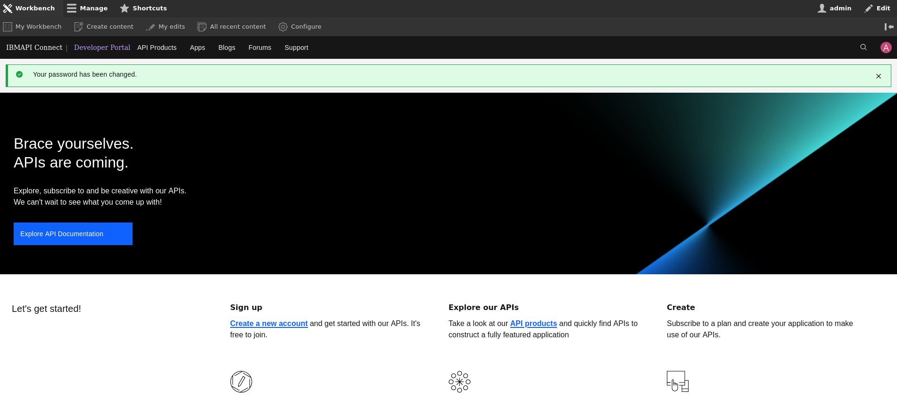

# Guided Exercise: Creating Provider Organization


Log in to the Cloud Manager UI via a web browser, using the originally configured endpoint:

> https://admin.think.ibm/

## Provision a new Provider Organization

1. Click on **Manage Organizations** tile on Cloud Manager home page or **Provider Organizations** icon in the menu on the left.

   

2. Click on the **Add** button followed by the **Create organization** option.
   Note the available option to invite Organization Owner.

3. Use the below parameters in order to create a new *Provider Organization*:

   |Field|Value|
   |-----|-----|
   |Title|Workshop|
   |User registry|API Manager Local User Registry|
   |Type of user|New User|
   |Username|student|
   |Email|student@think.ibm|
   |First Name| ... |
   |Last Name| ... |
   |Password|student123|

   

4. Click the **Create** button at the bottom.

## Access the API Manager UI

Use the newly created (local) user **student** to log into the API Manager.

Go to API Manager UI in a web browser, using the originally configured endpoint.

> https://manager.think.ibm/



### Ensure Gateway Service is configured in Catalog

1. On the home screen click on the **Manage Catalogs** tile.

2. Click on the **Sandbox** catalog icon.

3. Select **Settings** from the top menu and then **Gateway Services**. You should see that the registered API Gateway is automatically associated with the *Catalog*.



**If this is not the case, you can associate your *Gateway* manually *(Gateway Services > Edit)* or check out the *Catalog Defaults* in the Cloud Manager UI > Settings section. This will be valid for all of the other catalogs as well.**

### Deploy Developer Portal for Sandbox Catalog

1. Being in the **Settings** section of *Sandbox* Catalog select the **Portal** tab from the left hand side menu.

2. Click on **Create** and choose the registered portal service.

   

3. Portal deployment will take some time. After portal is deployed check Mailhog inbox for mail with link to reset admin's password for the portal.
   
4. Access the portal URL and follow the prompts to reset ```admin``` user password. Verify that you can log in as portal **admin**.

> https://portal.think.ibm/workshop/sandbox/




You are now ready to publish APIs in API Connect.
