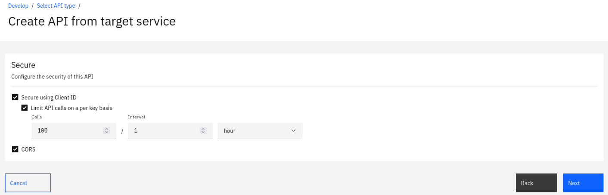

# Guided Exercise: Creating Proxy API

## Create an API

1. On the home screen click on the **Develop APIs and Products** tile.


2. Click on the **Add** button followed by the **API** option.

3. Select the **From target service** tile and click **Next**.

4. Enter the appropriate information to create a REST API definition.

  1. In the Title field, enter Branches.
  2. The Name and Base Path fields autopopulate with the terms branches and /branches respectively.
  3. Leave the Version field at 1.0.0.
  4. In the Target Service URL field, enter https://apictutorials.mybluemix.net/branches. 
  

5. Click Next.
6. In the Security dialog, take the following steps.

  1. Select Limit API calls on a per key basis.
  2. Click Next.
    

7. You see the progress as the new API gets created. When it is done, you see a Summary. Click Edit API. 
8. On the Design page, click Definitions in the side bar.
   
9.  Click Add.
10. In the Name field, enter address, and a Description of The format of the address object.
11. Using the same Definitions panel, configure the Properties definition according to the following table. Create new properties by clicking Add.

    | Property Name | Description | Type | Example |
    |---------------|-------------|------|---------|
    | street1 |	The first line of the address | string |	4660 La Jolla Village Drive  |
    | street2 |	The second line of the address| string |	Suite 300 |
    | city |	The city of the address |	string 	| San Diego |
    | state |	The state of the address |	string| CA |
    | zip_code |	The zip code of the address 	| string |	92122 |

    This is an OpenAPI schema definition and is presented to developers in the Developer Portal to provide them with information about the type of data to expect in their response. 

12. Click Save.
13. Create a second definition by clicking Add in the Definitions panel.
14. Name the definition branch and, in the Description field, enter The format of the branch field.
15. Configure the branch definition to have the properties listed in the following table by creating new properties and editing the default property. Create new properties by clicking Add.
Tip: Use ```uuidgen``` command to generate an example for id field. 

    | Property Name | Description | Type | Example |
    |---------------|-------------|------|---------|
    | address |	The address of the branch |	address |	 
    | type |	The type of branch |	string |	atm|
    | id |	The ID of the branch |	string | 9d72ece0-7e7b-11e5-9038-55f9f9c08c06|

16. Click Save.
17. In the side bar, select Paths to display the Paths panel. 
18. Click three dots icon next to `/` path and select Delete. Confirm the deletion.
    
19. Click Add.
20. In the Path name field, enter /details.
21. In the Operations section, click Add.
22. Select GET and click Add.
23. Click Save.
24. Click /details in the list of available paths.
25. Click GET in the list of Operations.
26. Scroll down. In the Response section, click Add.
    1.  Enter 200 in the STATUS CODE field.
    2.  Select branch in the SCHEMA field.
    3.  Enter 200 OK in the DESCRIPTION field.
27. Click Save.

## Test the REST API

1. Press **Offline** toggle next to **Save** button. This does the following:
   1. Create automatic product and publish it in Sandbox catalog.
   2. Create subscription from Test Application to automatic product.
   3. Enables *Endpoints* and *Test* tabs in API Development to be available.
2. Go to **Test** tab:
   
3. Click **Send**. You should get following error:
   
   This error is raised, as currently Gateway Service is using self-signed certificate to secure API Traffic.
4. Click on the link and accept self-signed certificate. Close the newly opened tab after accepting self-signed certificate.
5. Click **Send** again. You should now receive correct response:
   

Congratulations, you have successfully created and tested an API!

## Optional exercises

* Explore what is created in *Sandbox* catalog:
  * Product - what is its state, what actions are available on it in API Manager?
  * Application - what it contains and what actions are possible with it?
  * Consumer Organization
* Visit Developer Portal and:
  * Onboard a new user
  * Create new application and credentials
  * Explore available products
  * Explore API in API Explorer
  * Try calling the API
* Try out following tutorials:
  * [Create SOAP API](https://www.ibm.com/docs/en/api-connect/2018.x?topic=tutorials-tutorial-creating-soap-api)
  * [Import an API](https://www.ibm.com/docs/en/api-connect/2018.x?topic=tutorials-tutorial-importing-api)
  * [Creating a REST API definition that invokes an existing SOAP service](https://www.ibm.com/docs/en/api-connect/2018.x?topic=amt-tutorial-creating-rest-api-definition-that-invokes-existing-soap-service)
  * [Mapping JSON Content](https://www.ibm.com/docs/en/api-connect/2018.x?topic=tutorials-tutorial-mapping-json-content)
  