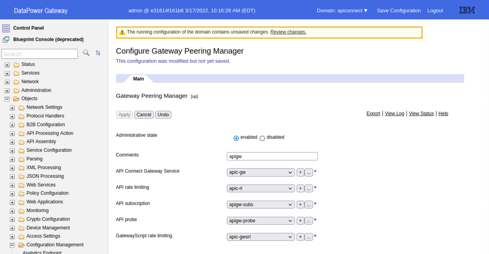
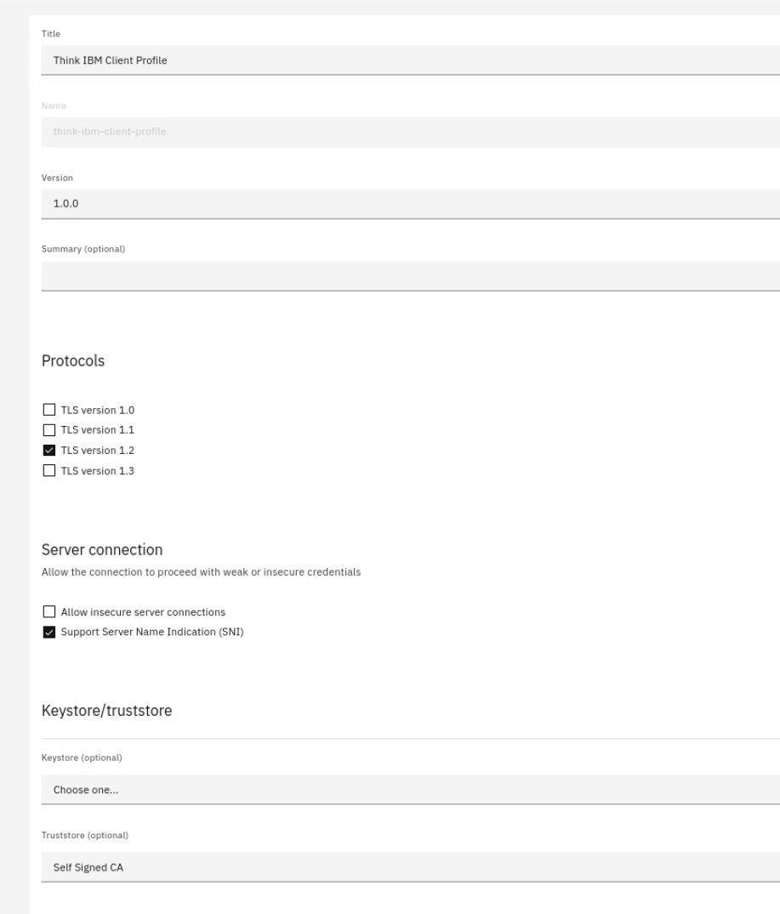

# Guided exercise: Configuring DataPower for API Connect

In this exercise you will configure DataPower Appliance for connecting to API Connect as a Gateway Service.

## Prerequisites

Ensure that certificate and key for `datapower.think.ibm` is present in your filesystem:
```
[root@think ~]# cd ~/ca-apic-script/
[root@think ca-apic-script]# ls -l datapower*
-rw-r--r-- 1 root root 1668 Mar 17 05:33 datapower.cnf
-rw-r--r-- 1 root root 1322 Mar 17 05:33 datapower.csr
-rw-r--r-- 1 root root 1708 Mar 17 05:33 datapower.key.pem
-rw-r--r-- 1 root root 6167 Mar 17 05:33 datapower.pem
```

If you have completed Certificate lab, above should be in place.

Verify if certificate is valid:
```
[root@think ca-apic-script]# openssl x509 -in datapower.pem -noout -text | grep -i not
            Not Before: Mar 17 12:33:53 2022 GMT
            Not After : Dec 11 12:33:53 2024 GMT
```

## Configure API Connect Gateway Service in DataPower

1. Login to your DataPower appliance through https://datapower.think.ibm:9090
2. Enable REST Management Interface:
   - Search for `rest` in seach box. Choose **REST Management Interface**
   - Enable the service by switching administrative state to **enabled** and applying the settings.
3. Create `apiconnect` domain:
   - Search for domain in search box and choose Application domain
     
   - Click **Add**
   - Name new domain *apiconnect* and press **Apply**. Make sure to leave other settings as-is:
     
   - Save configuration (button in upper-right corner).
   - Switch to newly created domain:
     

4. Upload certificates for `datapower.think.ibm` and CA for `think.ibm`:
   - Select **File Management**:
     
   - Choose **Upload files** next to `cert` directory:
     
   - Upload certificate files to `cert:///` filesystem:
     

5. Create Crypto Certificates:
   - Search for `cert` in search box and select **Crypto certificates**
   - Press add and create `cacert` certificate:
   - 
   - Apply your changes.
   - Create `datapower` certificate as well:
   - 

6. Create Crypto Key:
   - Search for `crypto key` in search box
   - Create new Crypto Key with following settings:
     

7. Create Validation Credentials:
   - Search for `val cred` in search box.
   - Create new Validation Credentials with following settings:
     

8. Create Identification Credentials:
   - Search for `ident cred` in search box.
   - Create new Identification Credentials with following settings:
     

9.  Create TLS Client Profile:
   - Search for `tls cli` in search box.
   - Create new TLS Client Profile using settings below:
     


11. Create TLS Server Profile:
   - Search for `tls server` in search box.
   - Create new TLS Server Profile using settings below:
     

11. Create Access Profile
    - Search for `acc pro` in search box.
    - Create new Access Profile using settings below:
      

12. Create Configuration Sequence
    - Search for `conf seq` in search box.
    - Create new Configuration Sequence using settings below:
      

13. Create Gateway Peerings
    - Search for `gat peer` in search box.
    - Create new Gateway Peering using settings below:
      
    - Create new Gateway Peering using settings below:
      
    - Create new Gateway Peering using settings below:
      
    - Create new Gateway Peering using settings below:
      
    - Create new Gateway Peering using settings below:
      
 
14. Create Gateway Peering Manager
     - Search for `peer man` in search box.
     - Create new Gateway Peering Manager using following settings:
       
 
15. Enable API Probe
     - Search for `api prob` in search box.
     - Configure API Probe as follows:
       

16. Configure API Connect Gateway Service
     - Search for `api con` in search box.
     - Configure API Connect Gateway Service as follows:
       
17. Save your configuration
    
API Connect Gateway service should be now up and running.

You can verify that by going to https://datapower.think.ibm:3000/health. The response should be `{"status": "ok"}`.

## Configure new API Connect Gateway Service in API Connect

1. Login to Cloud Manager.
2. Go to **Resources -> TLS -> TLS Client Profile -> Create**
3. Create new TLS Client Profile to ensure connectivity with new gateway is secure. You can reuse previously defined Truststore:
   
4. Create new Keystore:
   
5. Create new TLS Server Profile to ensure connectivity for API Traffic is secure:
   
   
6. Go to **Topology -> Register Service -> DataPower API Gateway**. Use following settings:
   

You should have successfully registered gateway service.

If that is not the case, go to troubleshooting Gateway Service.

## Troubleshooting API Connect Gateway Service

There are two places where information on why Gateway Service registration failed can be found:
- APIM pod logs
- API Connect Gateway Service Debug logs.

To check why Gateway Service registration failed on API Manager side, check APIM pod logs. Issue following command:
```
k get pod 
```

Find name of APIM pod and issue command:
```
k logs management-apim-<...>-<...> --tail-20 -f
```

Then try registering service again - the logs will show as gateway service is being registered.

If these logs do not provide further information, go to DataPower and configure log target that will record debug messages for API Connect Gateway Service (another name for it is Gateway Director).

In search field search for `log target`. Create new Log Target with following settings:


Make sure to subscribe log target to events from `apic-gw-service`:


Now you can go to **File manager** and navigate to directory `logtemp:///` to see file `gwd.log`. It will contain very verbose information what is failing.

> Note: the gateway service logs are not dependent on API Traffic. It is a good idea to keep such log target configured in all environments. 
