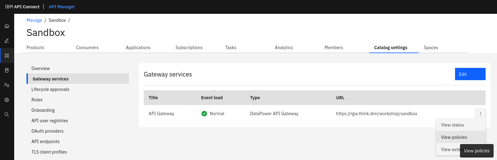

# Guided Exercise: Configure DataPower Service in Kubernetes

The goal of this exercise is to provide additional DataPower configuration to
API Connect Gateway Cluster operand. You will add a Global User Defined Policy (UDP) to
API Gateway so that it can be used in API Assembly.

## Prerequisites

1. Copy exercise files to your working directory
```
[root@think ~]# mkdir my-policy
[root@think ~]# cd my-policy/
[root@think my-policy]# cp -r ../write-to-datapower/* .
```
2. Review available files:
```
[root@think my-policy]# find . -type f
./config/write-to-datapower-log.cfg
./policy-implementation/write-to-datapower-log/writeToDatapowerLog.js
./policy-implementation/write-to-datapower-log/write-to-datapowerlog-logLevel-schema.json
```

View each of the files to see what the content is.

## Create config maps

You need to create two configmaps:
- one that will include files necessary to run UDP
- one that will include UDP configuration

1. Prepare `local.tar.gz` archive:
```
[root@think policy-implementation]# tar czvf local.tar.gz *
write-to-datapower-log/
write-to-datapower-log/writeToDatapowerLog.js
write-to-datapower-log/write-to-datapowerlog-logLevel-schema.json
```

2. Create `policy-implementation` configmap:
```
[root@think policy-implementation]# k create configmap policy-implementation --from-file=local.tar.gz
configmap/policy-implementation created
```

3. Create `write-to-datapower-log` configmap:
```
[root@think my-policy]# k create configmap write-to-datapower-log --from-file=config/write-to-datapower-log.cfg
configmap/write-to-datapower-log created
```

4. Review created configmaps:
```
[root@think my-policy]# k get cm policy-implementation -o yaml
[root@think my-policy]# k get cm write-to-datapower-log -o yaml
```

## Update Gateway Service Operand

1. Check if Gateway Cluster operand is available:
```
[root@think my-policy]# k get gw
NAME   READY   STATUS    VERSION                 RECONCILED VERSION      AGE
gwv6   2/2     Running   10.0.1.5-ifix4-57-eus   10.0.1.5-ifix4-57-eus   8d
```

2. Edit the operand using `k edit gw gwv6` command and add the following section:
```yaml
spec:
  additionalDomainConfig:
  - name: apiconnect
    dpApp:
      config: 
      - write-to-datapower-log
      local:
      - policy-implementation
```

3. Check the status of the Gateway Cluster operand and pod:
```
[root@think my-policy]# k get gw
NAME   READY   STATUS    VERSION                 RECONCILED VERSION      AGE
gwv6   1/2     Pending   10.0.1.5-ifix4-57-eus   10.0.1.5-ifix4-57-eus   8d
[root@think policy-implementation]# k get pod gwv6-0
NAME     READY   STATUS    RESTARTS   AGE
gwv6-0   0/1     Running   0          11s
```

Wait for the pod to come up and operand to have status *Running*

## Check if the policy is available in API Manager.
   1. Login to API Manager
   2. Go to **Manage Catalogs -> Sandbox -> Catalog Settings -> Gateway Services**
   3. Click on three dots next to API Gateway and choose **View policies** from context menu.
      
   4. Find write-to-datapower-log policy in the list.

> Optional exercise: Create an API that use installed UDP and test it.

